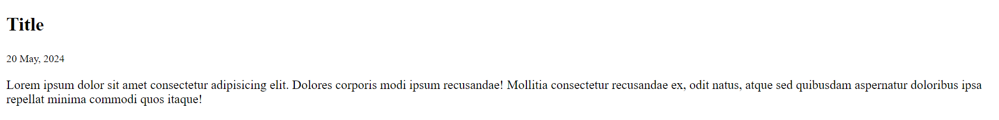
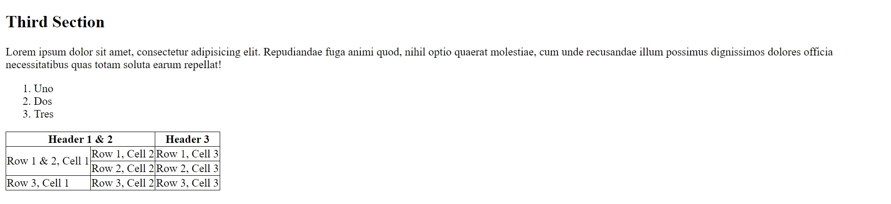
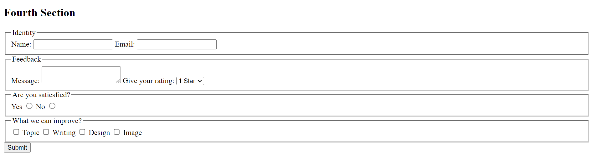
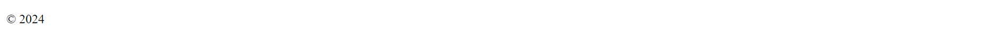
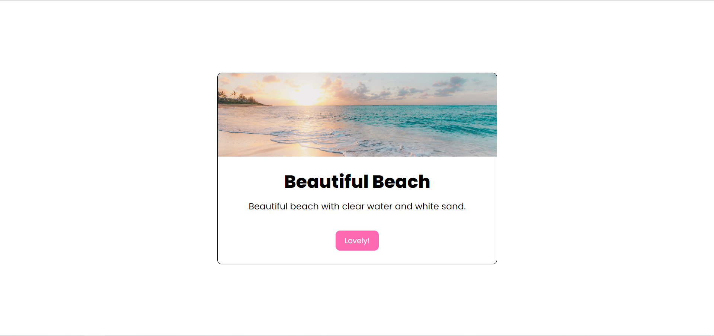

# Intro to Frontend Development Exercises

## Blog Page

Make a blog page that contains sections and exactly look like the attached image below.

This blog page divided into 3 main section:

1. Header
2. Body/Main
3. Footer

Separate those section with default separator from HTML.

### Header Section

This is a header with a logo and some menus below. Make sure all of the menu go into their respective website.

### Hero Section

Make a hero section that included an image with its caption. Don't forget to use the most suitable tag for this section.

Use this [link](https://images.unsplash.com/photo-1505533321630-975218a5f66f?q=80&w=1974&auto=format&fit=crop&ixlib=rb-4.0.3&ixid=M3wxMjA3fDB8MHxwaG90by1wYWdlfHx8fGVufDB8fHx8fA%3D%3D) for the hero image.

### Title Section

Just a simple text! Don't forget the date.

### First Section

A simple paragraph with a title. Don't forget to make the first sentence in the first paragraph bold and the first in second paragraph italic.

### Second Section

Make it similar!

### Third Section

Pay attention for the list and table content.

### Fourth Section

Let's make a form!

### Footer Section

A very simple footer right.

## Modal

Make a modal that looks just like this. The font used in this modal are Poppins.

Use this [link](https://images.unsplash.com/photo-1507525428034-b723cf961d3e?q=80&w=2073&auto=format&fit=crop&ixlib=rb-4.0.3&ixid=M3wxMjA3fDB8MHxwaG90by1wYWdlfHx8fGVufDB8fHx8fA%3D%3D) for the image.

