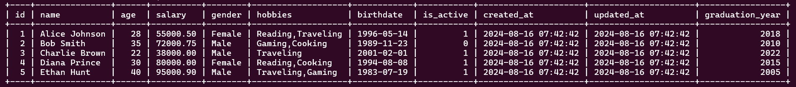

# First Basic DB Design and Development Exercise

1. Make a database and table that looks exactly like this:

   

2. Change the graduation_year column to start_year.

3. Rename the name column to full_name.

4. Show all employees' names, ages, and salary information without any additional data.

5. Find the ID, name, age, gender, and hobbies of employees who are no longer active.

6. Display all data of employees whose names end with "N".

7. Count the total salary and calculate the average age of all employees. Display this information in two columns named total_employees_salary and average_employees_age.

8. Delete data of employees whose names start with "A" or "B".

9. Double the salary of all employees who started working before 2011.

10. Find the top 3 employees with the highest salaries.

11. Display the name, age, and hobbies of employees whose hobbies include cooking. Order the data by their age.

12. Add 5 employees. You can decide all of their data, except their age, which must be 25 years old.

13. Show all employees age without having reapeated data.

14. Remove all of records.

15. Remove the table.

16. Remove the database.

17. Remove your operating system :) - JK.
